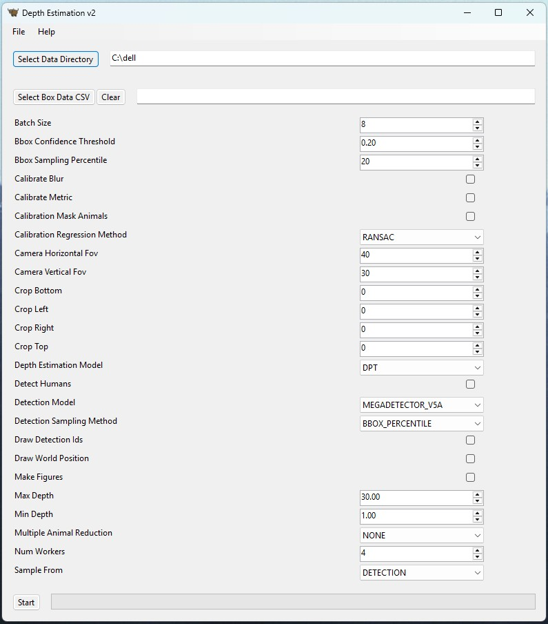

# Depth Estimation — Metric Distance & Height for Wildlife Camera Traps

[](LICENSE)
[](https://doi.org/10.1016/j.ecoinf.2025.103520)
[](https://www.python.org/)
[](#installation)

Official implementation accompanying:

> **A robust metric distance and height estimation pipeline for wildlife camera trap imagery**
> Muhammad Aamir, Matthew Wijers, Andrew Loveridge, Andrew Markham
> *Ecological Informatics*, Volume 92, 103520 (2025). [https://doi.org/10.1016/j.ecoinf.2025.103520](https://doi.org/10.1016/j.ecoinf.2025.103520)

The pipeline turns raw camera-trap photos into **metric camera-to-animal distances and heights**, without requiring a laser rangefinder, a calibrated rig, or reliable EXIF/metadata. It combines animal detection, instance segmentation and monocular depth estimation (MDE) with an automated, reference-object-based calibration step that converts relative depth/disparity into real-world metres. It extends the original distance-sampling methodology of [Haucke et al. (2022)](https://doi.org/10.1016/j.ecoinf.2021.101536) with several newer MDE backbones, more robust calibration regression methods, updated animal detectors, and height estimation in addition to distance.

Both a desktop GUI and a command-line interface are provided for Windows, macOS (Intel & Apple Silicon) and Linux.



## Table of Contents

- [Overview](#overview)
- [Supported Models](#supported-models)
- [Installation](#installation)
- [Usage](#usage)
  - [Graphical Interface](#graphical-interface)
  - [Command Line](#command-line)
- [Data Structure](#data-structure)
- [Example Datasets](#example-datasets)
- [Output](#output)
- [Building From Source](#building-from-source)
- [Citation](#citation)
- [Acknowledgements](#acknowledgements)
- [License](#license)

## Overview

For each transect (camera-trap station), the pipeline:

1. **Calibrates** the depth model using photos of reference objects placed at known distances (`calibration_frames`), fitting a monotonic curve that maps the model's relative disparity output to metric depth.
2. **Detects** animals (and optionally people/vehicles) in each photo using MegaDetector.
3. **Segments** each detection with Segment Anything (SAM) to isolate the animal from background/occluding vegetation.
4. **Estimates depth** for the photo using the selected monocular depth estimation model, applying the fitted calibration where the model only produces relative depth.
5. **Samples** a representative depth value for each detection (bounding-box percentile, bounding-box bottom, or SAM-mask interior) and converts it, together with the detection's pixel position and the camera's field of view, into a metric 3D world position — yielding both **radial distance** and **height** of the animal relative to the camera.

Results are written per-transect to CSV/TXT files suitable for downstream distance-sampling and density-estimation workflows, with optional diagnostic PDF figures for calibration and per-detection sampling.

## Supported Models

### Monocular Depth Estimation (`--depth_estimation_model`)

| Flag value | Model | Output | Reference |
| --- | --- | --- | --- |
| `dpt` | DPT (MiDaS-hybrid, ONNX) | Relative (calibrated) | [Ranftl et al., ICCV 2021](https://arxiv.org/abs/2103.13413) |
| `dpt_pytorch` | DPT-Hybrid via MiDaS v3.1 (`torch.hub`) | Relative (calibrated) | [Birkl et al., 2023](https://arxiv.org/abs/2307.14460) |
| `depth_ahything_metric`\* | Depth Anything (metric, outdoor) | Metric | [Yang et al., CVPR 2024](https://arxiv.org/abs/2401.10891) |
| `depth_pro` | Apple Depth Pro | Metric | [Bochkovskii et al., 2024](https://arxiv.org/abs/2410.02073) |
| `metric_3d_v2_vit_s` | Metric3D v2 (ViT-S) | Relative (calibrated) | [Hu et al., 2024](https://arxiv.org/abs/2404.15506) |
| `monodepth2` | MonoDepth2 | Relative (calibrated) | [Godard et al., ICCV 2019](https://arxiv.org/abs/1806.01260) |

<sub>\* the enum name preserves a historical typo (`ahything`) from the codebase.</sub>

Metric models (Depth Anything metric, Depth Pro) bypass reference-object calibration entirely and require `sample_from=detection`. All other models are relative/disparity models and are calibrated automatically per transect from the `calibration_frames`.

The repository also contains standalone wrappers for **UniDepth v2** (`unidepthv2.py`), an ONNX build of **Depth Pro** (`depth_pro.py`) and **MiDaS v2.1** (`MiDas.py`); these are not currently exposed through the `--depth_estimation_model` option but can be wired in following the pattern of the other model files.

### Animal Detection (`--detection_model`)

| Flag value | Model | Reference |
| --- | --- | --- |
| `megadetector_v5a` (default) | MegaDetector v5a | [Beery et al., 2019](https://arxiv.org/abs/1907.06772) |
| `megadetector_v5b` | MegaDetector v5b | [Beery et al., 2019](https://arxiv.org/abs/1907.06772) |
| `megadetector_v6` | MegaDetector v6 (via PytorchWildlife) | [Hernandez et al., 2024](https://arxiv.org/abs/2405.12930) |

Detections can alternatively be supplied as a precomputed CSV (`--box_data_csv`, e.g. exported from TrapTagger), skipping detection entirely.

### Segmentation

[Segment Anything (SAM, ViT-B)](https://arxiv.org/abs/2304.02643) is used to obtain a pixel-accurate instance mask for each detection when `--detection_sampling_method sam` is selected.

### Calibration Regression (`--calibration_regression_method`)

`ransac` (default) · `leastsquares` · `poly` · `ransac_poly` · `piecewise_linear` — fit to the relationship between each calibration frame's disparity and a reference frame, in either disparity or metric-depth space (`--calibrate_metric`).

## Installation

```bash
git clone https://github.com/Morphocam/Depth-Estimation.git
cd Depth-Estimation

# Python 3.10 or 3.11 recommended (3.12 has known GTK-binding build issues on Linux)
conda create --name depth-estimation python=3.10
conda activate depth-estimation

pip install -r requirements.txt
```

Pre-built executables for Windows, macOS and Linux are also published under [Releases](https://github.com/Morphocam/Depth-Estimation/releases) — no Python installation required.

### Model Weights

The ONNX-based models (DPT, MegaDetector v5a, SAM, Depth Anything, Metric3D v2) are downloaded automatically on first use, or can be fetched in advance:

```bash
# Linux/macOS
./weights/download.sh

# Windows (PowerShell)
./weights/download.ps1
```

MegaDetector v5b requires manually placing `md_v5b.0.0.pt` inside `weights/` (not auto-downloaded due to file size). MegaDetector v6, Depth Pro, MiDaS v3.1 and Monodepth2 weights are fetched automatically via `PytorchWildlife`, `transformers`/HuggingFace Hub, `torch.hub`, and the official Monodepth2 release respectively, the first time each model is selected.

## Usage

### Graphical Interface

```bash
python main.py
```

Select your data directory (see [Data Structure](#data-structure)), configure the detection/depth/calibration/sampling options in the scrollable panel, and press **Start**. Configuration is persisted between runs.

### Command Line

```bash
python main.py --cli --help
```

Every configuration field in [`config.py`](config.py) is automatically exposed as a CLI flag (booleans become `--flag`/`--no_flag`, enums accept lowercase names, e.g. `--depth_estimation_model dpt_pytorch`). Typical usage:

```bash
python main.py --cli \
  --data_dir /path/to/DepthEstimationData \
  --depth_estimation_model dpt \
  --detection_model megadetector_v5a \
  --calibration_regression_method ransac \
  --detection_sampling_method bbox_percentile \
  --make_figures
```

## Data Structure

The data directory is user-named and must contain a `results` directory and a `transects` directory, with one subdirectory per camera-trap station:

```bash
DepthEstimationData
├── results
└── transects
    ├── transect_001
    │   ├── calibration_frames
    │   │   ├── 5.png
    │   │   ├── 10.png
    │   │   └── ...
    │   ├── calibration_frames_masks
    │   │   ├── 5.png
    │   │   ├── 10.png
    │   │   └── ...
    │   └── detection_frames
    │       ├── detection_000001.png
    │       └── ...
    └── ...
```

- **`calibration_frames`** — photos of reference objects, each file named after the distance in metres it represents (e.g. `10.png`, or `10m`), or accompanied by a `.txt` file containing the distance.
- **`calibration_frames_masks`** — one equally-named binary mask per calibration photo, with the reference object marked white and everything else black.
- **`detection_frames`** — arbitrarily named photos of the animals to estimate distance/height for. `.jp(e)g` and `.png` are supported.

Optional extensions:

- **Precomputed metric depth** — placing a `detection_frames_depth` directory alongside `detection_frames` (matching filenames, `.exr` by default) lets a transect supply ready-made depth maps and skip the depth model entirely for that image.
- **Precomputed detections** — `--box_data_csv path/to/boxes.csv` supplies bounding boxes (columns `Site.Name, Image.ID, Score, Left, Right, Top, Bottom`) instead of running a detector, matched against detection-frame filenames.
- **Legacy `_cropped` directories** — `calibration_frames_cropped`/`detection_frames_cropped` are still accepted for backwards compatibility; new datasets should use the `--crop_top/bottom/left/right` flags instead.

## Example Datasets

- **`datasets/Oxford_station`** — controlled ground-truth data collected on a surveyed grid at the WildCRU research base, Oxfordshire, UK.
- **`datasets/BVC_stations`** — real-world camera-trap footage from Bubye Valley Conservancy, Zimbabwe, used to validate the pipeline in the field.

Both are laid out in the [Data Structure](#data-structure) format above and are the field/ground-truth datasets used in the accompanying paper.

## Output

For every processed transect, results are written to the `results` directory:

- **`results.csv`** — one row per detection: `transect_id, frame_id, detection_idx, detection_confidence, depth, world_x, world_y, world_z, error_status`. `world_y` corresponds to the estimated height, `world_z`/radial position to distance.
- **`results.txt`** — a simplified `Camera trap / Label / Observation / Radial distance` table for direct use with downstream distance-sampling and abundance-estimation tools.
- **`calibration/*.pdf`** and **`sampling/*.pdf`** (only with `--make_figures`) — diagnostic depth-map and detection visualizations, optionally annotated with detection IDs (`--draw_detection_ids`) and estimated world positions (`--draw_world_position`).

## Building From Source

Standalone executables are produced with [PyInstaller](https://pyinstaller.org/) via [`main.spec`](main.spec):

```bash
pyinstaller main.spec
```

- **Linux** — [`Dockerfile.ubuntu22`](Dockerfile.ubuntu22) builds a Ubuntu 22.04-compatible executable, including GTK bindings needed by the Toga GUI on Linux.
- **macOS** — after building the `.app` bundle, [`dmgbuild_settings.py`](dmgbuild_settings.py) packages it into a `.dmg` installer; [`scripts/macos_codesign.sh`](scripts/macos_codesign.sh) handles signing and notarization for releases.
- **Windows** — `main.spec` produces a standalone `.exe` directly.

## Citation

If you use this software or build on this work, please cite:

```bibtex
@article{aamir2025robust,
  title   = {A robust metric distance and height estimation pipeline for wildlife camera trap imagery},
  author  = {Aamir, Muhammad and Wijers, Matthew and Loveridge, Andrew and Markham, Andrew},
  journal = {Ecological Informatics},
  volume  = {92},
  pages   = {103520},
  year    = {2025},
  issn    = {1574-9541},
  doi     = {10.1016/j.ecoinf.2025.103520},
  url     = {https://www.sciencedirect.com/science/article/pii/S1574954125005291}
}
```

This pipeline builds on the original distance-sampling methodology, please also consider citing:

```bibtex
@article{haucke2022overcoming,
  title   = {Overcoming the distance estimation bottleneck in estimating animal abundance with camera traps},
  author  = {Haucke, Timm and K{\"u}hl, Hjalmar S. and Hoyer, Jacqueline and Steinhage, Volker},
  doi     = {https://doi.org/10.1016/j.ecoinf.2021.101536},
  journal = {Ecological Informatics},
  volume  = {68},
  pages   = {101536},
  year    = {2022},
  issn    = {1574-9541},
  url     = {https://www.sciencedirect.com/science/article/pii/S1574954121003277}
}
```

The pipeline additionally builds on the following third-party models — please cite the ones relevant to your configuration:

```bibtex
@article{megadetector,
  title   = {Efficient pipeline for camera trap image review},
  author  = {Beery, Sara and Morris, Dan and Yang, Siyu},
  journal = {arXiv preprint arXiv:1907.06772},
  year    = {2019}
}
@inproceedings{dpt,
  title     = {Vision transformers for dense prediction},
  author    = {Ranftl, Ren{\'e} and Bochkovskiy, Alexey and Koltun, Vladlen},
  booktitle = {Proceedings of the IEEE/CVF International Conference on Computer Vision},
  pages     = {12179--12188},
  year      = {2021}
}
@article{midas3.1,
  title   = {MiDaS v3.1 -- A Model Zoo for Robust Monocular Relative Depth Estimation},
  author  = {Birkl, Reiner and Wofk, Diana and M{\"u}ller, Matthias},
  journal = {arXiv preprint arXiv:2307.14460},
  year    = {2023}
}
@article{segment_anything,
  title   = {Segment Anything},
  author  = {Kirillov, Alexander and Mintun, Eric and Ravi, Nikhila and Mao, Hanzi and Rolland, Chloe and Gustafson, Laura and Xiao, Tete and Whitehead, Spencer and Berg, Alexander C. and Lo, Wan-Yen and Doll{\'a}r, Piotr and Girshick, Ross},
  journal = {arXiv:2304.02643},
  year    = {2023}
}
@inproceedings{depthanything,
  title     = {Depth Anything: Unleashing the Power of Large-Scale Unlabeled Data},
  author    = {Yang, Lihe and Kang, Bingyi and Huang, Zilong and Xu, Xiaogang and Feng, Jiashi and Zhao, Hengshuang},
  booktitle = {CVPR},
  year      = {2024}
}
@article{depthpro,
  title   = {Depth Pro: Sharp Monocular Metric Depth in Less Than a Second},
  author  = {Bochkovskii, Aleksei and Delaunoy, Ama{\"e}l and Germain, Hugo and Santos, Marcel and Zhou, Yichao and Richter, Stephan R. and Koltun, Vladlen},
  journal = {arXiv preprint arXiv:2410.02073},
  year    = {2024}
}
@inproceedings{unidepth,
  title     = {UniDepth: Universal Monocular Metric Depth Estimation},
  author    = {Piccinelli, Luigi and Yang, Yung-Hsu and Sakaridis, Christos and Segu, Mattia and Li, Siyuan and Van Gool, Luc and Yu, Fisher},
  booktitle = {CVPR},
  year      = {2024}
}
@article{metric3dv2,
  title   = {Metric3Dv2: A Versatile Monocular Geometric Foundation Model for Zero-shot Metric Depth and Surface Normal Estimation},
  author  = {Hu, Mu and Yin, Wei and Zhang, Chi and Cai, Zhipeng and Long, Xiaoxiao and Chen, Hao and Wang, Kaixuan and Yu, Gang and Shen, Chunhua and Shen, Shaojie},
  journal = {IEEE Transactions on Pattern Analysis and Machine Intelligence},
  year    = {2024}
}
@inproceedings{monodepth2,
  title     = {Digging into Self-Supervised Monocular Depth Estimation},
  author    = {Godard, Cl{\'e}ment and Mac Aodha, Oisin and Firman, Michael and Brostow, Gabriel J.},
  booktitle = {Proceedings of the IEEE/CVF International Conference on Computer Vision},
  year      = {2019}
}
@article{pytorchwildlife,
  title   = {Pytorch-Wildlife: A Collaborative Deep Learning Framework for Conservation},
  author  = {Hernandez, Andres and Miao, Zhongqi and Vargas, Luisa and Beery, Sara and Dodhia, Rahul and Lavista, Juan},
  journal = {arXiv preprint arXiv:2405.12930},
  year    = {2024}
}
```

## Acknowledgements

This work was supported by the Natural Environment Research Council. The authors extend their sincere gratitude to the management and research staff of the Bubye Valley
Conservancy for their support and assistance with data collection. We also thank the Paul G. Allen Family Foundation for its generous funding contributions to the WildCAT Trust in Zimbabwe, which made the Bubye Valley Conservancy survey possible.

## License

Released under the [MIT License](LICENSE).
